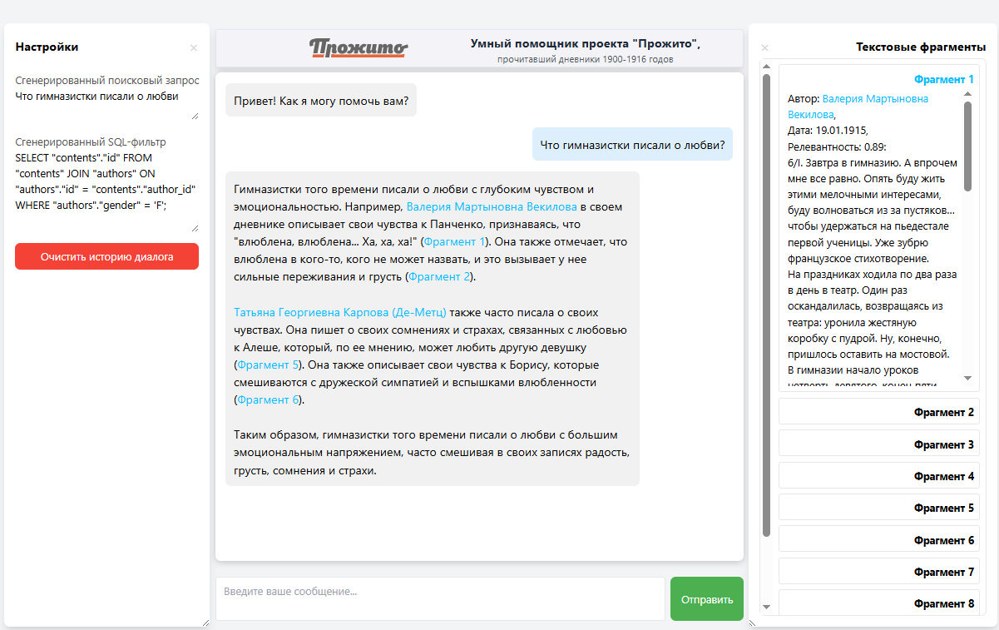

# Appendix A. Chatbot interface

The chatbot interface consists of three windows:

* *The central window* is the dialog window, which is used for communication between the user and the assistant and displays the dialog history. The chatbot's response includes hyperlinks to the found relevant fragments in parentheses, as well as hyperlinks to the personal pages of individuals included in the corpus.
* *The left window* contains debugging information. The first field displays the search query used to find relevant fragments and construct the SQL query. Below, the generated SQL query is shown, based on which data filtering is performed. The red button at the bottom is responsible for clearing the conversation history.
* *The right window* contains information about the found relevant fragments. For each fragment, the following details are provided in sequence: the author (with a hyperlink to their personal page), the entry date, the hybrid search relevance score, and the fragment text. A total of 10 fragments are extracted and displayed for each query.

Dialog translation:
* **Assistant**:\
Hello! How can I help you?
* **User**:\
What did schoolgirls write about love?
* **Assisstant**:\
Schoolgirls of that time wrote about love with deep emotion and intensity. For example, Valeria Martynovna Vekilova describes her feelings for Panchenko in her diary, confessing, "I’m in love, in love… Ha, ha, ha!" (Fragment 1). She also mentions being in love with someone she cannot name, which stirs strong emotions and sadness in her (Fragment 2).\
Tatiana Georgievna Karpova (De-Metz) also frequently wrote about her feelings. She expresses doubts and fears about her love for Alyosha, believing he might love another girl (Fragment 5). She also writes about her feelings for Boris, which blend friendly affection with flashes of infatuation (Fragment 6).\
Thus, schoolgirls of that time wrote about love with great emotional intensity, often mixing joy, sorrow, doubt, and fear in their entries.
